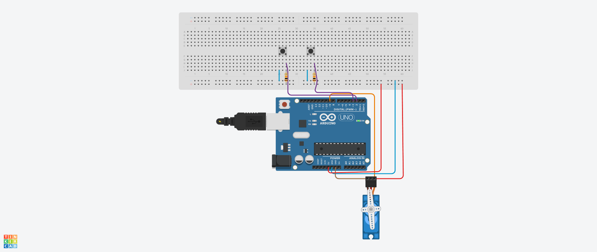

## Opdracht 1 

### Opdracht 
- 2 LED'S aansluiten op poort 10 en 13
- LED's knipperen om en om (2s/2s)

### Benodigdheden
- Arduino + Breadboard
- 2 LED's
- 2 weerstanden (220 &#937;)
- connectie draden

### Sketch

### Video
[opdracht1](https://drive.google.com/file/d/1u60c_ic3tCLTedm8m0OR-FKCggLCJdzk/view?usp=sharing)

### Bron
- Powerpoint presentatie van de les (start workshop)

## Opdracht 2 

### Opdracht
- 8 LED's aansluiten op externe poorten
- LED's heen en weer laten lopen

### Benodigdheden
- Arduino + Breadboard
- 8 LED's
- 8 weerstanden voor LED's (220 &#937;)
- connectie draden

### Sketch

### Video 
[opdracht2](https://drive.google.com/file/d/17X8eEmbCV8oMnKZVdUCGSxn6pijeLRl2/view?usp=sharing)

### Bron
- Powerpoint presentatie van de les (start workshop)

## Opdracht 3

### Opdracht 

- Een LED aansluiten op poort 5 en een op poort 11
- Knop aansluiten op poort 8

### Benodigdheden 
- Arduino + Breadboard
- 2 LED's 
- Knop
- 2 weerstand voor LED's (220 &#937;)
- 1 weerstand voor knop (10k &#937;)
- connectie draden

## Sketch 
 

### Video 
[opdracht3](https://drive.google.com/file/d/1V602VNbl3daNZ2acxsdiwSGX5RW6Sk41/view?usp=sharing)

### Bron
- Powerpoint presentatie van de les (start workshop)

## Opdracht 4

### Opdracht
6 LED's aansturen afhankelijk van de hoekverdraaiing van de potmeter

### Benodigdheden
- Arduino + Breadboard
- 6 LED's
- 6 weerstanden voor LED's (220 &#937;)
- Potmeter
- connectie draden

### Sketch

### Video
[opdracht4](https://drive.google.com/file/d/1ZkApd_rXOtwKQYo7_XlgizZCpbRBHQHc/view?usp=sharing)

### Bron
- Powerpoint presentatie van de les (vervolg workshop)

## Opdracht 5

### Opdracht

- Ontwerp een functie op de Arduino die een servomotor bestuurt op basis van twee drukknoppen. De motor moet variabele snelheden en pauzes volgen afhankelijk van welke knop(pen) wordt/worden ingedrukt.

### Benodigdheden
- Arduino + Breadboard
- Servomotor
- 2 drukknoppen
- 2 weerstanden voor drukknoppen (10k &#937;)
- connectie draden

### Sketch

### Video
[opdracht5](https://drive.google.com/file/d/1MVGEPrZZfVsnHjOVNiPE7dVDJDxwKGVl/view?usp=sharing)

### Bron
- Powerpoint presentatie van de les (vervolg workshop)

## Opdracht 6

### Opdracht
- Servo motor besturen met een HC-SR04 Ultrasonic sensor

### Benodigdheden
- Arduino + Breadboard
- Servo motor
- HC-SR04 Ultrasonic sensor
- connectie draden

### Sketch

### Video
[opdracht6](https://drive.google.com/file/d/1vd8bQq5pzYcrDsnh-GzUpPQMb1q7M-Gk/view?usp=sharing)

### Bron
- [Getting Started with the HC-SR04 Ultrasonic sensor](https://projecthub.arduino.cc/Isaac100/getting-started-with-the-hc-sr04-ultrasonic-sensor-7cabe1)

